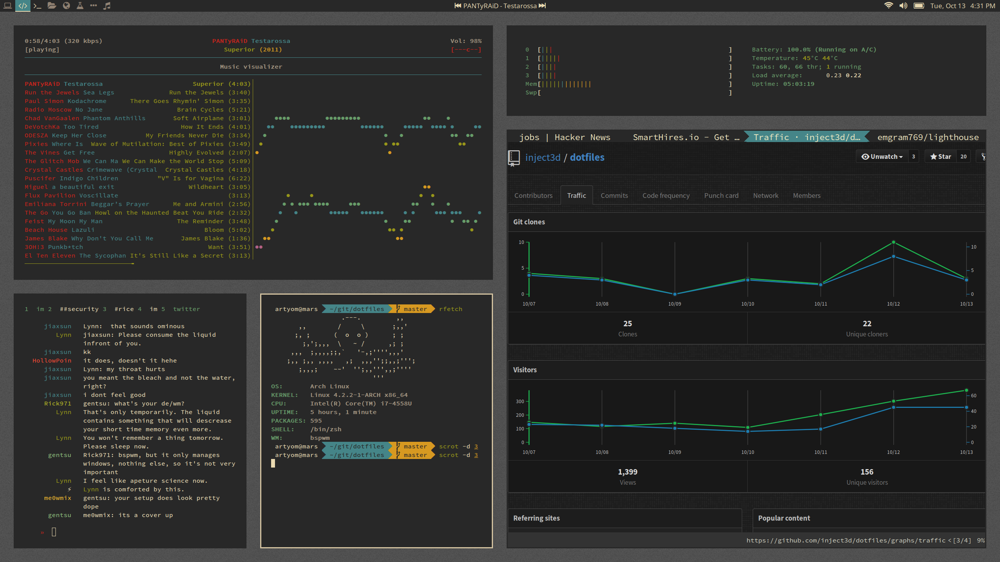

## installed software
Not all of this is required for the configuration, it's just the list of software that I personally use and recommend.

### interface
+ **bspwm** _window manager_  chosen because it's easily configured
+ **sxhxd** _hotkey daemon_  default for bspwm and I have no reason to change it
+ **rxvt-unicode-256xresources** _terminal emulator_  lightweight, extensible with perl
  + **urxvt-clipboard**  makes urxvt play nice with the x clipboard
  + **urxvt-resize-font**  enables on the fly font resizing.  very useful for small screens
  + **urxvt-vtwheel**  better scrolling support
+ **polybar** _status bar_ easy to use panel with a tiny footprint
+ **feh** _image viewer and background setter_  it's simple and does everything you need
+ **unclutter-xfixes** _X cursor hider_  the cursor is useless for a keyboard driven config, so hide it

### internet
+ **weechat** _irc client_  extensible irc client with great community support
+ **neomutt** _mail client_  fast and well supported console email client
  + **msmtp**  _mtp client_  sends email
  + **offlineimap** _imap client_  syncs email
+ **chromium** _web browser_  golden standard web browser
  + **vimium**  browse with just your keyboard
  + **stylish**  user styles manager
  + **noscript**  block javascript from running automatically
  + **https everywhere**  force https where possible
  + **ublock origin**  ad and nuisance blocker
+ **w3m** _web browser_  console web browser, used for image previews in ranger
+ **rtorrent** _download manager_  trimmed down bittorrent client

### media
+ **beet** _music organizer_ fetches music metadata and cover art
+ **cmus** _music player_  simple console music player
+ **mpv** _video player_  do-it-all video player for streaming and playing local media

### office
+ **khal** _calendar_  console calendar
+ **khard** _contacts__ console contacts.  integrates well with mutt
+ **zathura** _document viewer_  lightweight extensible document viewer with a vim-like interface
  + **poppler** _pdf rendering lib_  much faster than mupdf
+ **scrot** _screenshotter_  simple

### programming
+ **vim** _text editor_  the one true text editor
  + **ale** _linting_ integrates with a bunch of differnt linters
  + **vim-plug** _plugin manager_  lightweight and less finicky than other managers
  + **vim-airline** _status bar_  replaces the standard vim status bar with some useful eye candy
  + **vim-numbertoggle**  smart relative line-number toggling
  + **vim-gitgutter**  shows git diffs
  + **vim-trailing-whitespace**  highlights spaces where they shouldn't be
  + **auto-pairs**  spawns matched brackets / quotes
  + **nerdtree**  in-editor file browser
  + **gruvbox** _colour scheme_  low contrast colour scheme that's easy on the eyes

### utilities
+ **zsh** _shell_ very powerful shell that remains compatible with bash
+ **tmux** _terminal multiplexer_  will save your life when X11 quits working
+ **rofi** _dynamic menu_ application launcher
+ **ranger** _file manager_  extensible file manager that can use w3m for image previews
+ **pacaur** _aur helper_  yaort is for losers
+ **htop** _task manager_  beautified and more useful top
+ **progress** tool to show the progress of coreutils basic commands
+ **tlp** _power management_  fire and forget power manager
+ **powertop** _power management_  great for identifying sources of energy waste

### fonts / themes
+ **source code pro for powerline** _monospace font_  primary font used in the system, extremely legible
+ **source code sans** _sans serif font_  font used for web browsing that retains the legibility of source code pro
+ **arc-grey** _gtk theme_  flat gtk theme with dark highlights
+ **paper** _icon theme_  flat and simple icon theme
